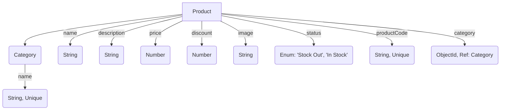

# Backend Development Challenge

### Environment

NodeJS/Express JS, JavaScript/TypeScript, MongoDB

---

### What Has Been Built

#### 1. Product Creation

Functionality to create a product with the following attributes:

- **Name**: The product's name.
- **Description**: A brief description of the product.
- **Price**: The product's price.
- **Discount**: Applicable discount (percentage).
- **Image**: Product's image url.
- **Status**: Availability status (Stock Out / In Stock).
- **Product Code**: An auto-generated unique identifier.

#### 2. Product Code Generation

Product codes are auto-generated based on the product name:

1.  Extract the **longest strictly increasing substring** (consecutive letters in alphabetical order and lowercase).
2.  If multiple substrings of equal length exist, concatenate them.
3.  Append the starting and ending index of the substring in the product name.
4.  Add the **hashed value** of the product name at the beginning as a prefix with a dash (-).
5.  **Format**: `<hashed product name>-<start_index><substring><end_index>`

#### 3. Product-Category Association

- Each product must be under a **valid category**.
- Product-category associations are validated to ensure consistency.

#### 4. Product Information Update

Functionality to update the following product details:

- **Status**: Update availability (Stock Out / In Stock).
- **Description**: Modify product description.
- **Discount**: Update the discount percentage.

#### 5. Get Products with Filters

Method to retrieve products with the following filters:

- **Filter by Category**: Fetch products belonging to a specific category.
- **Search by Name**: Search for products by name (partial or full match).
- **Pricing Calculation**: In the response, include the original and the final price after applying the discount (if any).

---

### Additional Notes

- Proper validation, error handling, and uniqueness constraints (e.g., for product codes) are ensured.
- Clean, maintainable code is written.
- API responses are designed with clarity and consistency.

### Database Design (Data Model Diagram)

