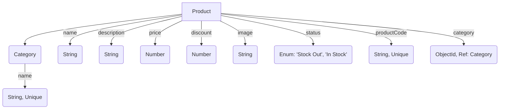

### Environment

NodeJS/Express JS, JavaScript/TypeScript, MongoDB

---

### Database Design (Data Model Diagram)



How to Run and Organize

1. Clone the repository and navigate to the project directory.
2. Install the dependencies using:
   ```
   npm install
   ```
3. Set up your environment variables in a `.env` file based on the `example.env` provided.
4. To run the application in development mode, use:
   ```
   npm run dev
   ```
5. Implement the Products with Filters feature, which includes the following methods to retrieve products:
   - **Filter by Category**: Fetch products belonging to a specific category.
   - **Search by Name**: Search for products by name (partial or full match).
   - **Pricing Calculation**: In the response, include the original and the final price after applying the discount (if any).

---

### Additional Notes

- Proper validation, error handling, and uniqueness constraints (e.g., for product codes) are ensured.
- Clean, maintainable code is written.
- API responses are designed with clarity and consistency.
